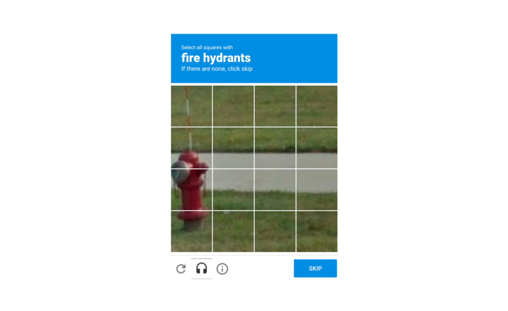

CAPTCHAs make it more difficult for bots to submit fraudulent information via online forms, but they can also get in the way of humans interacting with your website.

It can be frustrating for users to be served CAPTCHAs as they can be deceptively difficult to solve, and end up wasting a lot of your customer’s time.

Differences in how people interpret CAPTCAs can create unintended challenges for visitors. For example, a user may be prompted to click all the squares in the below image that contain a fire hydrant:

People in Mountain View, California will click the three bottom squares on the left without hesitation because they see a familiar red hydrant. A few will click all four squares on the left because the little antenna on the top is technically part of the fire hydrant. Somebody from Tokyo, Japan might hit the “SKIP” button, because their fire hydrants don’t look like the one in the picture. Billions of non-native English speakers might not know what a fire hydrant is and it may not translate correctly.